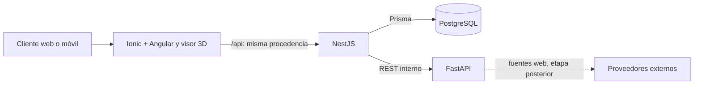

# Diseño de Habita3D para EP1

La [arquitectura](docs/architecture/overview.md), el
[modelo de datos](docs/architecture/data-model.md) y los
[ADR](docs/adr/0001-staging-local-con-terraform.md) contienen el detalle y las
decisiones. Este resumen distingue los flujos implementados de los previstos.

## Límites de cada componente

- **Angular/Ionic** ofrece navegación, visor 3D, selección de terminaciones y un
  presupuesto demostrativo calculado en el navegador. Capacitor está configurado;
  todavía no se han añadido las plataformas nativas.
- **NestJS** valida solicitudes, posee la lógica de la vista previa y es el único
  servicio que escribe en PostgreSQL. La API incluye proyectos y autenticación básica.
- **FastAPI** calcula una comparación determinista de tres niveles de terminación
  para EP1. Sus valores CLP/m² son ilustrativos y no proceden de tiendas web.
- **PostgreSQL** almacena proyectos, usuarios y sesiones. Las recomendaciones de
  la vista previa se devuelven en la respuesta; no se guardan aún como entidad.

## Contrato de integración de EP1

El formulario de inicio envía `name`, `areaM2` y `budgetClp` a
`POST /api/projects/preview`. NestJS transforma área y presupuesto al contrato de
`POST /recommendations/compare` de FastAPI, valida la respuesta y solo entonces
crea el proyecto mediante Prisma. Devuelve `project` y `recommendation`, cuyo
`source` es `demo`. Si Python no responde, NestJS devuelve 503; si la respuesta
especializada no cumple el contrato, devuelve 502. Los datos de entrada inválidos
producen 400. [La guía de demostración](docs/ep1-demo.md) prueba el recorrido.

El frontend usa `/api` relativo. En Compose y en el staging definido por Terraform,
Nginx lo redirige a NestJS; en desarrollo, Angular usa su proxy local. FastAPI y
PostgreSQL no reciben peticiones directas del navegador en el flujo normal.

## Módulos y seguridad

`backend/src/modules/` separa `auth`, `users`, `projects`, `scenes`, `materials`,
`recommendations` y `health`. `projects` y `auth` tienen operaciones implementadas;
los módulos de otros dominios son preparación para próximas entregas. El registro
y el inicio de sesión crean sesiones de 24 horas: las contraseñas se derivan con
`scrypt`, los tokens aleatorios se almacenan como hash y el cliente usa
`Authorization: Bearer`. `GET /api/auth/me` y `POST /api/auth/logout` exigen sesión.
Las rutas de proyectos **aún son públicas** y los proyectos no tienen propietario;
esta autenticación inicial no representa un sistema de permisos completo.

## Pendientes del producto

- La extracción autorizada de precios y disponibilidad desde fuentes web, su fecha
  y procedencia, y una recomendación basada en esos datos.
- La asociación de proyectos a usuarios, controles de acceso y roles.
- Una aplicación nativa instalada y una evaluación de interacción 3D táctil completa.
- Despliegue público, TLS, estado remoto cifrado y operación continua de staging.

Terraform ofrece un **plan** de staging local aislado; la aplicación integrada se
verifica por separado con Docker Compose y CI. Un `terraform plan` válido no
equivale a un `terraform apply` ni a una aplicación publicada.
