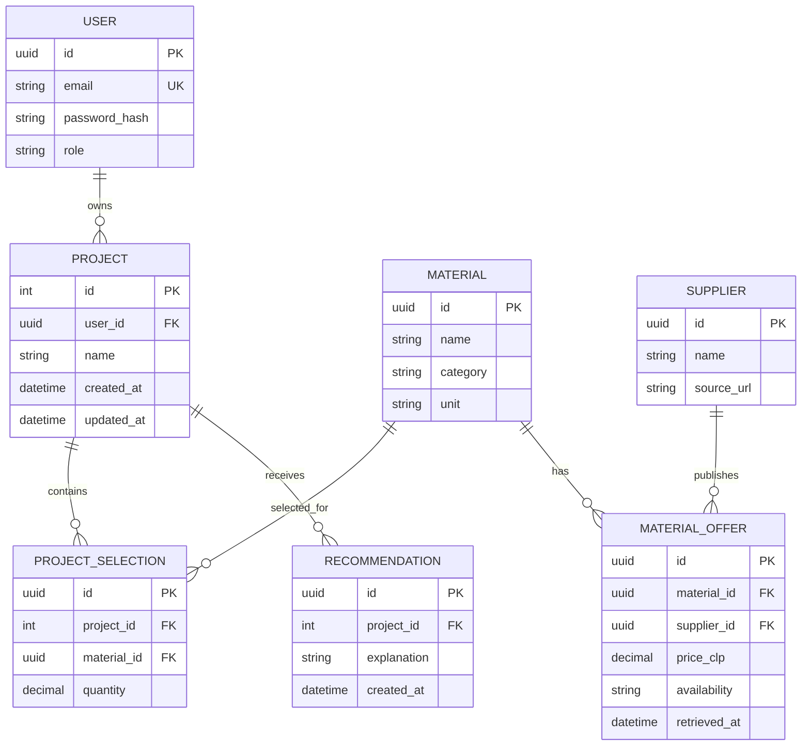

# Modelo inicial de datos

**Estado:** base implementada en el commit `97be109`; ampliación conceptual propuesta para las siguientes entregas. NestJS es dueño del esquema PostgreSQL mediante Prisma. Python no modifica sus tablas directamente.

## Tabla implementada

| Tabla | Clave | Atributos | Evidencia |
| --- | --- | --- | --- |
| `Project` | `id` entero autoincremental | `name` obligatorio, `createdAt`, `updatedAt` | [schema.prisma](../../backend/prisma/schema.prisma) y [migración inicial](../../backend/prisma/migrations/20260915050607_init_projects/migration.sql) |

La relación implementada hoy es solo `Project`; no existen aún tablas de usuarios, materiales, ofertas o recomendaciones. La API de proyectos expone creación y consulta. El despliegue debe ejecutar la migración antes de usar esta API; ese paso todavía no está automatizado.

## Modelo lógico propuesto

Este diagrama **no corresponde a migraciones existentes**. Sirve para justificar el crecimiento del modelo: ofertas separadas de materiales permiten guardar precio, disponibilidad y fecha por proveedor; selecciones relacionan terminaciones con un proyecto; recomendaciones conservan una explicación. Antes de implementarlo se revisarán cardinalidades, permisos, restricciones e índices con los contratos finales de la API y la fuente web elegida.
