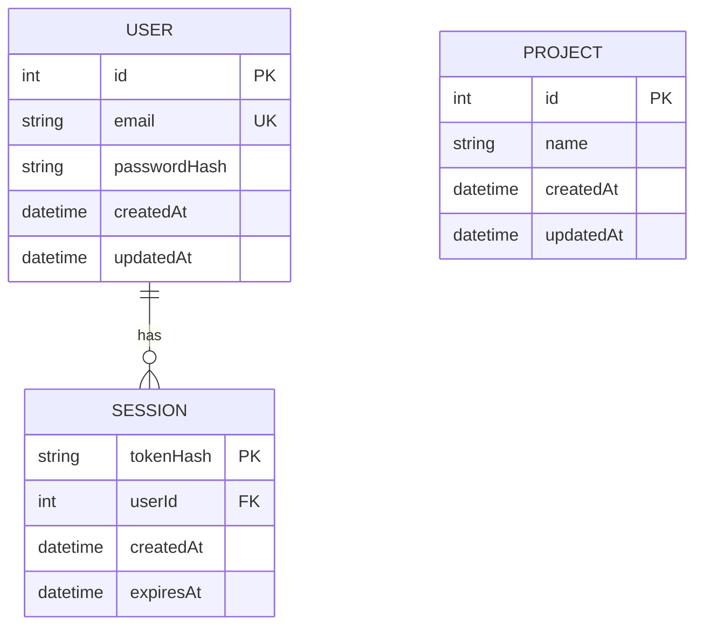
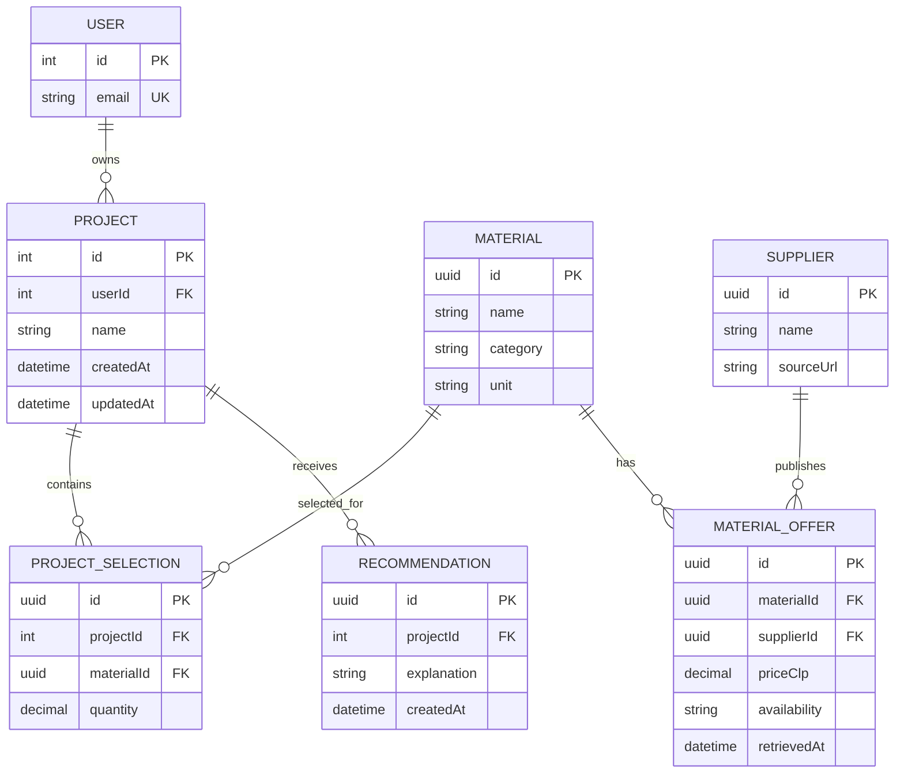

# Modelo de datos de Habita3D

**Estado de EP1:** las tablas `Project`, `User` y `Session` están definidas en
[Prisma](../../backend/prisma/schema.prisma) y sus
[migraciones](../../backend/prisma/migrations/). NestJS es dueño del esquema
PostgreSQL; FastAPI no escribe directamente en la base. El contenedor de NestJS
ejecuta `prisma migrate deploy` antes de iniciar la API.

## Modelo implementado

| Tabla | Clave y relación | Datos principales | Uso en EP1 |
| --- | --- | --- | --- |
| `Project` | `id` entero autoincremental | `name`, `createdAt`, `updatedAt` | `GET/POST /api/projects`; la vista previa crea un proyecto después de recibir una comparación válida. |
| `User` | `id` entero autoincremental; `email` único | `email`, `passwordHash`, `createdAt`, `updatedAt` | Registro e inicio de sesión. La contraseña no se almacena en texto claro. |
| `Session` | `tokenHash` como clave primaria; `userId` referencia a `User` con eliminación en cascada | `createdAt`, `expiresAt` | Consulta y cierre de sesión con token Bearer; el token en claro no se guarda en la base. |

`Project` **no tiene todavía `userId` ni relación con `User`**. Las rutas de
proyectos siguen siendo públicas; la autenticación básica de EP1 no equivale a
autorización por propietario. La recomendación calculada por FastAPI se devuelve
en la respuesta de vista previa, pero no se persiste.

## Evolución propuesta, sin migraciones todavía

Este segundo diagrama expresa la dirección del producto, **no tablas existentes**.
Separar ofertas de materiales permitiría registrar proveedor, precio,
disponibilidad y fecha de captura. Las selecciones relacionarían terminaciones
con proyectos y las recomendaciones conservarían su explicación. Antes de
implementarlo deben definirse permisos, política de retención, restricciones,
índices y contratos con las fuentes web autorizadas.
