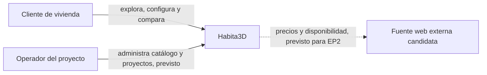
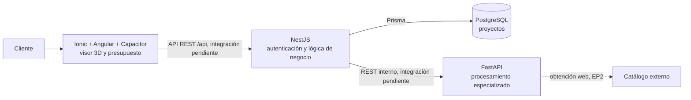
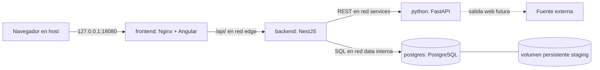

# Arquitectura inicial de Habita3D

**Estado:** diseño de EP1, actualizado el 26-09-2026. Distingue el código que existe de las integraciones previstas. [Terraform](../../infrastructure/terraform/README.md) define el staging local; no se ha aplicado todavía.

## Problema, usuarios y alcance

Los clientes de proyectos habitacionales necesitan visualizar espacios y terminaciones antes de construir, comparar alternativas y comprender su costo. Los usuarios previstos son clientes compradores y, para la gestión del catálogo y proyectos, operadores del equipo. Habita3D propone un recorrido 3D, selección de terminaciones y presupuesto, con recomendaciones futuras basadas en preferencias, necesidades y precios/disponibilidad procedentes de fuentes web.

Los objetivos de arquitectura son mantener un cliente web/móvil reutilizable, aislar la lógica de negocio y los datos, permitir procesamiento especializado en Python, y desplegar con cambios repetibles y credenciales fuera de Git. La EP1 delimita la definición de estos contratos y un plan de staging local. Quedan fuera de este alcance la extracción web automatizada, recomendaciones productivas, autenticación real y despliegue público. Las restricciones actuales son la ausencia de proveedor cloud y de cuenta de staging compartida, el prototipo de frontend con datos locales y el Dockerfile de NestJS aún sin preparación de Prisma.

La separación Ionic/Angular, NestJS, FastAPI y PostgreSQL aprovecha el monorepositorio existente: el cliente sirve la experiencia 3D, NestJS concentra reglas y persistencia, y Python queda preparado para tareas de datos. Se consideró reunir la lógica en un solo backend, pero mantener FastAPI delimita el procesamiento previsto y permite probarlo de forma independiente; esta separación añade una llamada de red y exige contratos y observabilidad entre servicios. El [ADR de staging](../adr/0001-staging-local-con-terraform.md) explica por qué se eligió el proveedor Docker para EP1.

En EP1 ya existe un visor 3D con plano SVG y presupuesto **demostrativo**. La autenticación, la recomendación, la recuperación de precios web y el flujo completo entre servicios siguen pendientes. Como fuente web inicial se considera un catálogo de materiales de construcción con precios públicos, por ejemplo el [catálogo de Sodimac Chile](https://www.sodimac.cl/sodimac-cl/lista/CATG10731/Materiales-de-Construccion). La selección definitiva del método de acceso y la revisión de términos, `robots.txt`, licencia, actualización y calidad se harán antes de cualquier extracción automatizada en EP2.

### Contexto

### Contenedores de software

NestJS es el único servicio de aplicación que administra PostgreSQL y el punto principal de entrada para el frontend. FastAPI expone un endpoint de salud; todavía no procesa datos de materiales ni recibe solicitudes de NestJS. La interfaz actualmente carga planos SVG locales y **no consume la API**. Las flechas indicadas como pendientes expresan el contrato objetivo, no funcionalidad demostrada hoy.

## Despliegue preliminar de staging

Terraform y el proveedor Docker definen recursos aislados de Compose sobre el mismo host Docker local:

| Zona | Miembros | Acceso |
| --- | --- | --- |
| `edge` | frontend y NestJS | Solo frontend publica un puerto al loopback del host. |
| `services` | NestJS y FastAPI | REST interno; Python conserva salida web para futuras fuentes. |
| `data` | NestJS y PostgreSQL | Red Docker interna; PostgreSQL no publica puerto al host ni es accesible desde Python. |

Al aplicar el plan, el frontend serviría rutas Angular mediante `try_files` y reenviaría `/api/` a NestJS con el [Nginx de staging](../../infrastructure/terraform/staging/nginx.conf). El backend recibiría `DATABASE_URL` y `PYTHON_SERVICE_URL` desde Terraform; el código todavía no utiliza la segunda variable. La contraseña de PostgreSQL se suministra mediante una variable sensible y, tras un `apply`, quedaría en el estado local de Terraform, que no se versiona. Los cuatro contenedores tienen health checks definidos, pero el actual `/api/health` de NestJS no inspecciona dependencias.

## Flujo de información

1. **Actual:** Angular genera una escena 3D desde el SVG y calcula un presupuesto demostrativo en el navegador. NestJS ofrece `GET/POST /api/projects` con validación y Prisma; FastAPI responde `/health`. Estos flujos todavía no están unidos por una petición de usuario.
2. **Meta de EP1:** Angular consulta NestJS; NestJS consulta una operación útil de FastAPI, usa PostgreSQL y devuelve una respuesta estructurada. Se demuestra también un error controlado.
3. **Meta de EP2:** Python obtiene datos de una fuente web autorizada, los valida y normaliza; NestJS almacena procedencia, fecha, precio y disponibilidad. La recomendación posterior explicará sus criterios y permitirá al usuario modificarla.

## Seguridad y decisiones

El frontend nunca conecta directamente con PostgreSQL o FastAPI. La base de datos no tiene puerto público en staging; el frontend solo expone loopback. Los secretos no se guardan en Git ni se imprimen en CI. Los riesgos y límites del estado local se describen en la [guía de staging](../../infrastructure/terraform/README.md). Las decisiones están registradas en [ADR 0001](../adr/0001-staging-local-con-terraform.md) y [ADR 0002](../adr/0002-redes-y-acceso-staging.md). El [modelo de datos](data-model.md) distingue la tabla implementada del diseño propuesto.
