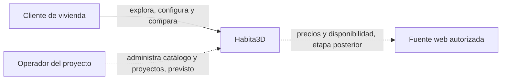
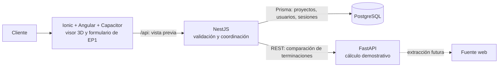
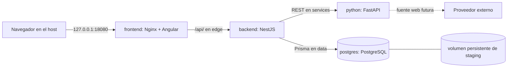

# Arquitectura de Habita3D para EP1

**Estado:** diseño e integración inicial de EP1. El desarrollo integrado se ejecuta
con Docker Compose. [Terraform](../../infrastructure/terraform/README.md) define
un staging local preliminar y reproducible, validado con `plan` pero sin `apply`.

## Problema, usuarios y alcance

Los clientes de proyectos habitacionales necesitan visualizar una vivienda y sus
terminaciones antes de construir, comparar alternativas y comprender el efecto en
el presupuesto. El cliente comprador usa el visor; un operador podrá administrar
catálogos y proyectos en etapas posteriores. Habita3D apunta a recomendaciones
basadas en presupuesto, preferencias, necesidades y precios/disponibilidad de
fuentes web. **EP1 demuestra la arquitectura y un flujo integrado con datos
ilustrativos; todavía no consulta proveedores web.**

La fuente web **considerada** para la siguiente etapa es el
[catálogo de materiales de construcción de Sodimac Chile](https://www.sodimac.cl/sodimac-cl/lista/CATG10731/Materiales-de-Construccion).
Es una candidata, no una integración implementada ni una fuente de los valores
mostrados por EP1. Antes de automatizar su uso se revisarán condiciones de acceso,
licencia, estructura de datos, cobertura, disponibilidad y frecuencia de cambio.
La capacidad adaptativa propuesta ordenaría materiales y terminaciones según
presupuesto, preferencias de estilo y necesidades del cliente, usando ofertas
actualizadas y explicando los criterios de cada sugerencia. La comparación actual
solo aplica valores ilustrativos por superficie y presupuesto.

Los objetivos son reutilizar el cliente Angular del navegador en una futura app
móvil, concentrar reglas y persistencia en una API, aislar el cálculo especializado
en Python, y poder
repetir la infraestructura sin introducir credenciales en Git. La elección de
Ionic/Angular aprovecha el visor y sus activos 3D; NestJS valida y coordina las
operaciones; FastAPI permite evolucionar hacia tareas de datos sin trasladar ese
ecosistema al proceso Node; PostgreSQL aporta persistencia relacional. La llamada
adicional entre NestJS y Python tiene costo y posibles fallos: por eso el backend
usa tiempo límite, valida la respuesta y devuelve errores controlados. Mantener
ambos servicios en el mismo repositorio facilita cambios de contrato coordinados.

La EP1 tiene restricciones concretas: no se ha elegido proveedor cloud ni existe
una cuenta compartida de staging; las estimaciones 3D y la comparación en Python
usan datos de demostración; Capacitor está configurado pero no se han generado
plataformas nativas. Para el alcance de las etapas siguientes se deja la selección
de fuentes web autorizadas, su actualización y validación, permisos por proyecto,
despliegue público y observabilidad completa.

### Contexto

### Contenedores de software

NestJS es la única aplicación que administra PostgreSQL y la entrada principal
del frontend. El visor construye la escena a partir de un SVG local y calcula su
presupuesto demostrativo en el navegador. En otra sección de inicio, Angular sí
solicita una vista previa a NestJS; esa operación conecta las cuatro piezas.
Las rutas de proyectos son públicas por ahora. La API de autenticación ofrece
registro, login, consulta de sesión y logout; todavía no asigna proyectos a
usuarios ni aplica autorización por propietario.

## Flujo de una vista previa

1. Angular envía `POST /api/projects/preview` con nombre, superficie en m² y
   presupuesto entero en CLP.
2. NestJS valida el DTO y llama `POST /recommendations/compare` en FastAPI usando
   `PYTHON_SERVICE_URL` y un tiempo límite de cinco segundos.
3. FastAPI compara tres niveles ilustrativos (`basic`, `standard`, `premium`) y
   responde con costo, diferencia, ajuste al presupuesto, explicación y
   `source: "demo"`. No usa disponibilidad ni precios de comercio web.
4. NestJS comprueba el contrato, persiste `Project` con Prisma y devuelve
   `{ project, recommendation }`. Si Python falla o devuelve datos inesperados,
   informa 503 o 502 y no crea el proyecto. Entradas inválidas devuelven 400.

La [prueba de humo](../../scripts/ep1-smoke.sh) verifica HTTP, recomendación,
persistencia y rechazo de datos inválidos en Compose. Las pruebas unitarias y el
control de secretos complementan ese recorrido en CI. La salud `/api/health`
comprueba que NestJS responde; no inspecciona por sí sola PostgreSQL ni Python.

## Staging preliminar con Terraform

Terraform usa el proveedor Docker para definir recursos separados de Compose
sobre un host Docker local:

| Zona | Miembros | Acceso |
| --- | --- | --- |
| `edge` | Frontend y NestJS | Solo el frontend publica un puerto en el loopback del host. |
| `services` | NestJS y FastAPI | REST interno; Python no tiene puerto publicado al host. |
| `data` | NestJS y PostgreSQL | Red Docker interna; PostgreSQL no publica puerto y Python no se une a ella. |

Nginx sirve las rutas Angular y reenvía `/api/` a NestJS en el mismo origen. El
backend recibe `DATABASE_URL` y `PYTHON_SERVICE_URL` desde Terraform. La contraseña
de PostgreSQL entra por una variable sensible; tras un `apply` quedaría también
en el estado local de Terraform, excluido de Git. Un `plan` correcto **no prueba**
que este staging se haya desplegado. El [ADR 0001](../adr/0001-staging-local-con-terraform.md)
documenta la elección local; el [ADR 0002](../adr/0002-redes-y-acceso-staging.md)
explica las redes.

## Seguridad, datos y evolución

Las contraseñas de cuentas se derivan con `scrypt`; los tokens de sesión se
guardan como hashes y caducan a las 24 horas. La autenticación básica protege
`/api/auth/me` y `/api/auth/logout`, pero **no** las rutas de proyectos. El
[modelo de datos](data-model.md) separa las tablas implementadas (`Project`,
`User`, `Session`) de las entidades futuras de materiales, proveedores, ofertas,
selecciones y recomendaciones. Antes de extraer información de una fuente web
habrá que comprobar sus condiciones de uso, licencias, calidad y frecuencia de
actualización, y guardar procedencia y fecha de cada precio.

La [CI](../../.github/workflows/ci.yml) analiza dependencias y secretos, ejecuta
pruebas y builds, levanta Compose para la prueba integrada y valida el plan
Terraform. La protección de `main`, los revisores y las verificaciones obligatorias
son ajustes de GitHub que deben comprobarse fuera del repositorio. El staging local
no proporciona TLS, alta disponibilidad ni una URL pública.
